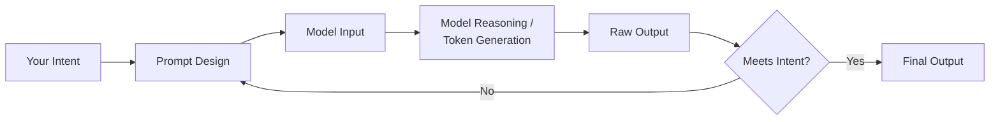
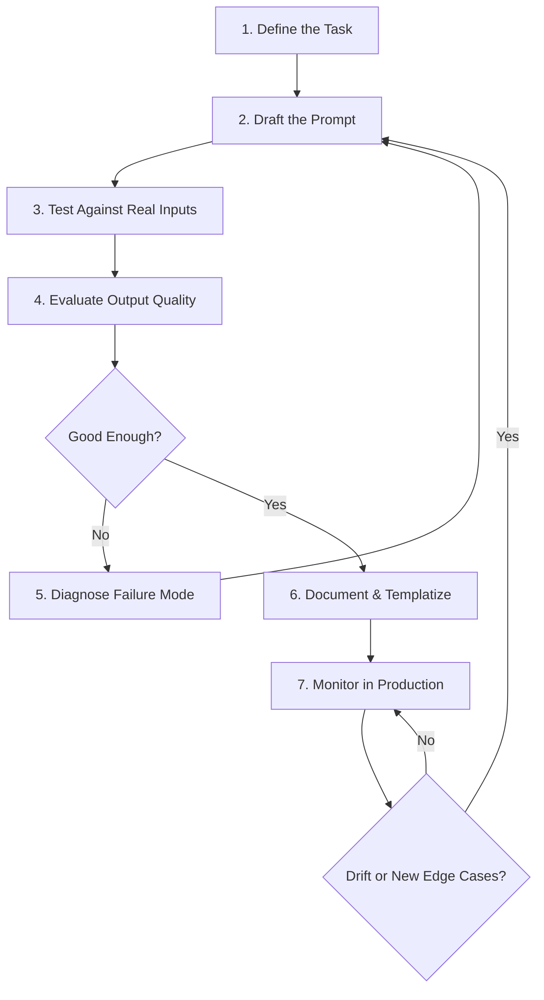
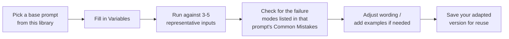

# 🧠 Prompt Engineering

> A production-grade, professionally organized Prompt Library and Prompt Engineering reference for OpenAI GPT, Claude, Gemini, DeepSeek, and other modern LLMs.

[](LICENSE)
[](#-repository-structure)
[](#-how-to-contribute)

---

## 📖 Table of Contents

- [Project Overview](#-project-overview)
- [Purpose](#-purpose)
- [Repository Structure](#-repository-structure)
- [How Prompt Engineering Works](#-how-prompt-engineering-works)
- [What Makes a Good Prompt](#-what-makes-a-good-prompt)
- [The Prompt Lifecycle](#-the-prompt-lifecycle)
- [Prompt Components](#-prompt-components)
- [Best Practices](#-best-practices)
- [Common Mistakes](#-common-mistakes)
- [Recommended Workflow](#-recommended-workflow)
- [Using Prompts With Different LLMs](#-using-prompts-with-different-llms)
- [How to Modify Prompts](#-how-to-modify-prompts)
- [Prompt Testing](#-prompt-testing)
- [Prompt Evaluation](#-prompt-evaluation)
- [Prompt Optimization](#-prompt-optimization)
- [Prompting Techniques](#-prompting-techniques)
- [Structured Output](#-structured-output)
- [Prompt Chaining & Templates](#-prompt-chaining--templates)
- [Model Parameters](#-model-parameters)
- [Function Calling, Tool Calling & APIs](#-function-calling-tool-calling--apis)
- [MCP Compatibility](#-mcp-compatibility)
- [Complete Usage Guide](#-complete-usage-guide)
- [How to Contribute](#-how-to-contribute)
- [Keeping This Library Updated](#-keeping-this-library-updated)
- [Future Improvements](#-future-improvements)
- [License](#-license)

---

## 🎯 Project Overview

**prompt-engineering** is a curated, production-ready library of prompts, prompt patterns, system prompts, and reusable templates designed for real-world use with large language models. It's built to demonstrate professional prompt engineering practice — the kind that goes into shipped products, not just casual chat experimentation.

Every prompt in this repository is:

- **Complete** — no placeholders, no "fill in the rest yourself"
- **Structured** — consistent fields (Purpose, Variables, Example I/O, Tips, Best Practices, Common Mistakes) so prompts are easy to scan, adapt, and trust
- **Model-agnostic by default** — written to work well across OpenAI, Claude, Gemini, and DeepSeek, with model-specific notes where behavior actually differs
- **Grounded in current best practice** — guardrails against hallucination, ambiguity, and inconsistent output are built into the prompts themselves, not left as an afterthought

This repository doubles as both a **working tool** (copy a prompt, fill in the variables, use it) and a **reference guide** (learn *why* each prompt is structured the way it is).

## 🧭 Purpose

Most "prompt collections" online are unstructured lists of one-liners with no explanation of when to use them, why they work, or how to adapt them. This repository exists to fix that by providing:

1. A **library** of 150+ complete, production-ready prompts across marketing, programming, education, translation, document analysis, spreadsheets, SQL, and more
2. A **pattern reference** explaining the underlying techniques (few-shot, chain-of-thought, ReAct, etc.) so you can build your *own* prompts, not just copy these
3. A **portfolio-quality example** of how a senior prompt engineer organizes, documents, and maintains prompt work professionally

## 📁 Repository Structure

```
prompt-engineering/
│
├── README.md                     # This file — full guide to the library
├── LICENSE                       # MIT License
├── .gitignore
│
├── prompts/
│   ├── marketing/                # 20 prompts — blog, SEO, ads, copywriting, strategy
│   ├── programming/               # 26 prompts — languages, frameworks, DevOps, review
│   ├── education/                 # 15 prompts — lessons, quizzes, tutoring, study guides
│   ├── translation/               # 10 prompts — translation, localization, tone
│   ├── pdf-analysis/              # 10 prompts — summarize, extract, analyze documents
│   ├── excel/                     # 10 prompts — formulas, pivots, VBA, dashboards
│   ├── sql/                       # 14 prompts — generate, optimize, design, per-dialect
│   ├── templates/                 # 10 reusable prompt skeletons
│   ├── system-prompts/            # 11 professional persona system prompts
│   ├── developer-prompts/         # 5 prompts for building AI applications (RAG, agents)
│   ├── user-prompts/              # 5 reusable everyday end-user prompts
│   ├── prompt-patterns/           # 12 explained prompting techniques
│   └── examples/                  # 6 real-world worked examples combining patterns
│
└── images/                        # Visual assets referenced by documentation
```

Every prompt file follows the same structure: **Title → Description → Purpose → When to Use → Variables → Prompt → Example Input → Example Output → Tips → Best Practices → Common Mistakes.**

## ⚙️ How Prompt Engineering Works

At its core, prompt engineering is the practice of designing the *input* to a language model so that its statistical next-token-prediction behavior reliably produces the *output* you actually want. A model doesn't "understand" intent the way a person does — it generates the most probable continuation of the text you give it, shaped by its training. Prompt engineering is how you steer that probability distribution toward useful, correct, well-formatted output.



Effective prompt engineering treats the prompt as an **interface**, not a one-off message — the same discipline you'd apply to designing a function signature or an API contract applies here: be explicit about inputs, outputs, and edge cases.

## ✅ What Makes a Good Prompt

A strong prompt is:

| Quality | What It Means |
|---|---|
| **Specific** | States exactly what's needed — audience, tone, format, length — instead of leaving it to the model to guess |
| **Contextual** | Provides the background information the model needs to make good decisions, not just the bare task |
| **Structured** | Organizes distinct pieces of information (task, context, constraints) so nothing gets lost in a wall of prose |
| **Bounded** | States constraints explicitly — what NOT to do is often as important as what to do |
| **Verifiable** | Where output could be wrong (facts, code, calculations), the prompt asks for reasoning, self-checks, or explicit uncertainty flagging |
| **Reusable** | Uses variables/placeholders so the same prompt structure works across many inputs, not just one specific case |

See [`prompt-patterns/`](prompts/prompt-patterns/) for the underlying techniques, and [`examples/bad-vs-good-prompt-comparison.md`](prompts/examples/bad-vs-good-prompt-comparison.md) for a concrete before/after.

## 🔄 The Prompt Lifecycle



Prompts are never really "done" — they're maintained artifacts. Treat prompt files the way you'd treat code: version them, test them, and revisit them when the underlying model changes or new edge cases appear.

## 🧩 Prompt Components

| Component | Role | Example |
|---|---|---|
| **System Prompt** | Sets persistent behavior, persona, and ground rules for the whole conversation/session | `prompts/system-prompts/senior-python-developer.md` |
| **Developer Prompt** | Application-level instructions for how the model should behave within a product (distinct from end-user messages) | `prompts/developer-prompts/rag-system-prompt.md` |
| **User Prompt** | The specific task/question from the end user in a given turn | `prompts/user-prompts/summarize-this.md` |
| **Context** | Background information the model needs — documents, prior conversation, retrieved data | The `{document_text}` variable in `prompts/pdf-analysis/` prompts |
| **Constraints** | Explicit boundaries — length limits, forbidden content, required format | "Keep under 400 words," "Never use SELECT *" |
| **Examples** | Sample input/output pairs demonstrating the desired pattern (few-shot) | See `prompt-patterns/few-shot.md` |

Not every prompt needs every component — a quick one-off user prompt doesn't need a system prompt. But production prompts (the kind in this library) are explicit about which layer each instruction belongs to.

## 🏆 Best Practices

1. **Be explicit, not implicit.** State the audience, tone, format, and length rather than hoping the model infers them correctly.
2. **Separate instructions from content.** Use clear delimiters (XML tags, markdown headers, triple backticks) so the model doesn't confuse your instructions with the data you're giving it.
3. **Ask for reasoning on non-trivial tasks.** Chain-of-thought measurably improves accuracy on math, logic, and multi-step analysis.
4. **Guard against fabrication explicitly.** For factual/statistical/citation-heavy tasks, explicitly instruct the model not to invent information it can't verify — see how this is done throughout `prompts/marketing/market-research.md` and `prompts/pdf-analysis/`.
5. **Iterate against real inputs**, not just the one example you had in mind when writing the prompt.
6. **Version your prompts.** Treat prompt changes like code changes — track what changed and why.
7. **Prefer structured output formats** (JSON/XML) when the output will be consumed by code, not read by a human.
8. **Keep system prompts stable; vary user prompts.** Don't cram task-specific detail into a system prompt meant to persist across many different requests.

## ⚠️ Common Mistakes

| Mistake | Why It Hurts | Fix |
|---|---|---|
| Vague requests ("write something good") | Model fills gaps with generic defaults | State audience, tone, format explicitly |
| No output format specified | Inconsistent structure across runs | Always define the exact desired format |
| Overloading one prompt with too many tasks | Quality drops on each sub-task | Use prompt chaining to split into steps |
| No guardrail against fabrication | Confident-sounding but false information | Explicitly instruct "do not invent data you can't verify" |
| Ignoring model-specific quirks | Prompts that work on one model degrade on another | See [Using Prompts With Different LLMs](#-using-prompts-with-different-llms) |
| Testing only the "happy path" input | Prompt breaks on edge cases in production | Test empty input, adversarial input, and unusual formatting |
| Never revisiting old prompts | Silent quality drift as models are updated | Periodically re-test prompts against current model versions |

## 🛠 Recommended Workflow



## 🤖 Using Prompts With Different LLMs

Most prompts in this repository work well across providers with no changes. A few things differ meaningfully:

### Claude (Anthropic)
- Responds particularly well to **XML tag structuring** (`<context>`, `<instructions>`, `<answer>`) — see [`prompt-patterns/xml-prompting.md`](prompts/prompt-patterns/xml-prompting.md)
- System prompts are a distinct, dedicated field in the API (not just the first message)
- Strong instruction-following on long, structured prompts — the detailed format used throughout this library works well as-is

### OpenAI (GPT models)
- Use the `system` role for persistent behavior, and prefer the **Responses API** (or Chat Completions for legacy integrations) — verify current capabilities in OpenAI's documentation, as this evolves
- JSON mode / structured outputs features (when available) are more reliable than prompt-only JSON instructions for strict schema compliance
- Function/tool calling is mature and well-documented — prefer it over prompt-engineered JSON for anything consumed by code

### Gemini (Google)
- Supports system instructions as a separate parameter from the user turn
- Strong multimodal support (image/video/audio inputs) — useful for prompts extended beyond text
- Function calling and structured output schemas are supported similarly to OpenAI's approach

### DeepSeek
- Chat Completions-compatible API (OpenAI-style), so most JSON/function-calling prompt patterns transfer directly
- Reasoning-focused model variants (e.g. R1-style models) may already perform extended internal reasoning — explicit chain-of-thought instructions can be less necessary or even redundant for these variants; check current model documentation

**General rule:** the *content* of a well-structured prompt (clear task, context, constraints, format) transfers across all providers. What sometimes needs adjusting is *where* instructions live (system field vs. user message) and whether to rely on native structured-output features vs. prompt-only formatting instructions. Because provider capabilities change frequently, always check current documentation before assuming a specific feature (e.g. a particular JSON mode or context window size) is available.

## 🔧 How to Modify Prompts

Every prompt in this library is a starting point, not a rigid script. To adapt one:

1. **Identify the variables** in the `Variables` table and fill them with your specifics
2. **Adjust the tone/persona** if the default doesn't match your use case — most prompts can be prefixed with a different role from `prompts/system-prompts/`
3. **Add examples** if you have real representative input/output pairs — this is usually the single highest-leverage change (see `prompt-patterns/few-shot.md`)
4. **Tighten constraints** if the output is too broad, or loosen them if it's too restrictive
5. **Re-test** against a few real inputs after any change — small wording changes can have outsized effects

## 🧪 Prompt Testing

Treat prompt testing like software testing — you need more than one happy-path example.

**A minimal test set for any production prompt should include:**
- 2-3 typical/representative inputs
- 1 edge case (empty input, extremely long input, minimal information given)
- 1 adversarial/malformed input (badly formatted data, contradictory instructions embedded in the input)
- 1 input where the "correct" answer is genuinely ambiguous, to see how the model handles uncertainty

**What to check for each run:**
- Does it follow the requested format consistently?
- Does it fabricate anything not present in the given context?
- Does it handle the edge case gracefully rather than breaking?
- Is output quality consistent across multiple runs of the same input (check for excessive randomness)?

## 📊 Prompt Evaluation

For anything beyond casual use, define evaluation criteria *before* you start iterating, not after:

| Criterion | Example Metric |
|---|---|
| **Correctness** | % of outputs factually accurate against ground truth |
| **Format compliance** | % of outputs that parse successfully as valid JSON/expected structure |
| **Consistency** | Variance in output across repeated runs of the same input |
| **Relevance** | Does the output actually address what was asked, not just something adjacent? |
| **Safety/Guardrail adherence** | Does it correctly decline or flag out-of-scope requests? |

For production systems, build a small evaluation set (10-50 representative cases) and re-run it whenever you change the prompt or the underlying model — this turns prompt iteration from guesswork into a measurable process.

## 🚀 Prompt Optimization

Once a prompt works, optimization means making it **more reliable and more efficient**, not just "better":

- **Trim unnecessary instructions.** Every sentence in a prompt should be doing work; remove instructions the model already follows by default.
- **Move static content to the system prompt**, and keep the user/task prompt focused on what changes per request — this also enables prompt caching on providers that support it, reducing cost and latency.
- **Replace verbose instructions with a well-chosen example** where a demonstration would be clearer than a paragraph of description (few-shot > lengthy zero-shot instructions for format-sensitive tasks).
- **Reduce output length requirements** to only what's actually needed downstream — shorter outputs are faster and cheaper.
- **A/B test wording changes** against your evaluation set rather than assuming a rewrite is an improvement.

## 🧠 Prompting Techniques

This library documents 12 core prompting patterns in depth under [`prompts/prompt-patterns/`](prompts/prompt-patterns/):

| Technique | One-Line Summary |
|---|---|
| [Zero-shot](prompts/prompt-patterns/zero-shot.md) | Task with no examples, relying on instruction alone |
| [Few-shot](prompts/prompt-patterns/few-shot.md) | Providing input/output examples to demonstrate the pattern |
| [Role Prompting](prompts/prompt-patterns/role-prompting.md) | Assigning a persona to shape tone and expertise |
| [Chain-of-Thought](prompts/prompt-patterns/chain-of-thought.md) | Reasoning step by step before the final answer |
| [Self-Consistency](prompts/prompt-patterns/self-consistency.md) | Multiple independent reasoning passes, majority answer |
| [ReAct](prompts/prompt-patterns/react.md) | Interleaving reasoning with tool use/actions |
| [Tree-of-Thought](prompts/prompt-patterns/tree-of-thought.md) | Exploring multiple reasoning branches with backtracking |
| [Prompt Chaining](prompts/prompt-patterns/prompt-chaining.md) | Breaking a task into sequential prompts |
| [Structured Prompting](prompts/prompt-patterns/structured-prompting.md) | Explicit sections instead of free-form prose |
| [XML Prompting](prompts/prompt-patterns/xml-prompting.md) | Tag-delimited sections, especially effective with Claude |
| [JSON Prompting](prompts/prompt-patterns/json-prompting.md) | Strict schema-based output for programmatic use |
| [Step-by-Step Prompting](prompts/prompt-patterns/step-by-step-prompting.md) | Explicit numbered process for reasoning or deliverables |

See [`prompts/examples/`](prompts/examples/) for worked demonstrations combining multiple patterns on realistic tasks.

## 📦 Structured Output

Three structured output approaches are documented with ready-to-use templates:

- **[JSON Output](prompts/templates/json-output-template.md)** — for programmatic consumption; prefer native structured-output/tool-calling API features over prompt-only instructions when available, since they enforce schema compliance more reliably
- **[XML Output](prompts/templates/xml-output-template.md)** — for separating reasoning from final answers, or delimiting multiple context sections; particularly reliable with Claude
- **[Markdown Output](prompts/templates/markdown-output-template.md)** — for human-readable documents, reports, and content meant to render directly

## 🔗 Prompt Chaining & Templates

For complex, multi-stage tasks, don't try to do everything in one prompt. See [`prompt-patterns/prompt-chaining.md`](prompts/prompt-patterns/prompt-chaining.md) for the pattern and [`examples/blog-post-full-workflow.md`](prompts/examples/blog-post-full-workflow.md) for a full worked example (outline → draft → assemble).

Reusable skeletons for common structures live in [`prompts/templates/`](prompts/templates/): role prompts, task prompts, JSON/XML/Markdown output, and domain templates for business, programming, education, research, and writing tasks.

## 🎛 Model Parameters

Beyond the prompt text itself, these generation parameters shape output:

| Parameter | What It Controls | Guidance |
|---|---|---|
| **Temperature** | Randomness of token selection (0 = deterministic, higher = more varied) | Use low (0-0.3) for factual/code/extraction tasks; higher (0.7-1.0) for creative writing |
| **Top P** | Nucleus sampling — restricts token choices to the smallest set whose cumulative probability exceeds P | Typically adjust one of Temperature or Top P, not both aggressively at once |
| **Max Tokens** | Hard limit on output length | Set high enough to avoid truncating mid-response, but bounded to control cost/latency |
| **Streaming** | Returns output incrementally as it's generated rather than waiting for completion | Use for responsive UIs (chat interfaces); not needed for batch/pipeline processing |

Exact parameter ranges and defaults vary by provider and model — check current API documentation rather than assuming values transfer exactly between providers.

## 🔌 Function Calling, Tool Calling & APIs

Modern LLM APIs support giving the model access to defined functions/tools it can invoke:

- **Function Calling / Tool Calling** — you define a schema (name, description, parameters) for each available function; the model decides when to call it and with what arguments, and your application executes the actual call and returns the result
- **Chat Completions** — the traditional message-array-based API pattern (`system`/`user`/`assistant` roles), widely supported (OpenAI, DeepSeek, and others use this or compatible formats)
- **Responses API** — newer API patterns (such as OpenAI's Responses API) that unify conversation state, tool use, and structured output more tightly than the classic Chat Completions format — check current provider documentation, as these interfaces are evolving

See [`prompts/developer-prompts/agent-tool-use-prompt.md`](prompts/developer-prompts/agent-tool-use-prompt.md) for a tool-use system prompt template, and [`prompt-patterns/react.md`](prompts/prompt-patterns/react.md) for the reasoning pattern underlying most tool-using agents.

## 🔗 MCP Compatibility

The **Model Context Protocol (MCP)** is an open standard for connecting LLM applications to external tools, data sources, and services in a consistent way, rather than each application implementing bespoke integrations per provider. Prompts in [`prompts/developer-prompts/`](prompts/developer-prompts/) — particularly the RAG and agentic tool-use templates — are written to be compatible with MCP-style tool definitions: they describe tool usage in terms of clearly named, described capabilities rather than provider-specific function-calling syntax, which maps cleanly onto MCP's tool schema. As MCP adoption and tooling evolve, check the protocol's current specification for the latest integration details.

## 📘 Complete Usage Guide

### How to Use This Prompt Library

1. **Browse by category** in [`prompts/`](prompts/) to find a prompt matching your task
2. **Read the full file** — not just the prompt block. The `When to Use`, `Tips`, and `Common Mistakes` sections meaningfully improve results
3. **Copy the `Prompt` block** and replace every `{variable}` with your specifics
4. **Paste into your LLM of choice** (see provider-specific notes below)
5. **Compare your output** against the `Example Output` to sanity-check you're getting a comparable quality/format
6. **Save your filled-in version** if you'll reuse it — consider keeping a personal `my-prompts/` folder alongside this library

### Using It With Claude
- Paste the system-prompt-style content (personas from `prompts/system-prompts/`) into Claude's dedicated system prompt field (via the API, Claude.ai Projects, or Claude Code custom instructions) for persistent behavior across a conversation
- For document analysis prompts (`prompts/pdf-analysis/`), you can upload the PDF directly in claude.ai rather than pasting extracted text — Claude reads PDFs natively
- Claude follows XML-tagged structure especially reliably — if a prompt's output isn't structured the way you want, wrap the desired sections in tags per `prompt-patterns/xml-prompting.md`

### Using It With ChatGPT
- System-prompt content works well as a **Custom Instruction** (persistent) or as the first message in a Project/GPT configuration
- For structured JSON output, enable JSON mode / structured outputs in the API if working programmatically, rather than relying on prompt instructions alone
- Long, highly structured prompts (like the ones in this library) work well as-is in the standard chat interface

### Using It With Gemini
- Use the dedicated system instruction field (in AI Studio or the API) for persona/system prompts
- Gemini's multimodal input support means document-analysis prompts can often take the file directly rather than requiring pre-extracted text

### How to Customize Prompts
See [How to Modify Prompts](#-how-to-modify-prompts) above — in short: fill variables, swap the persona if needed, add real examples, and tighten or loosen constraints based on your first test run.

### How to Test Prompts
See [Prompt Testing](#-prompt-testing) above — always test beyond the happy path: edge cases, adversarial input, and ambiguous cases.

### How to Improve Prompts
1. Run the prompt against your test set
2. For each failure, categorize it: ambiguity (add specificity), format drift (add explicit format instructions or examples), fabrication (add explicit anti-fabrication guardrails), or reasoning error (add chain-of-thought structure)
3. Make one change at a time and re-test — bundling multiple changes makes it hard to know what actually helped
4. Once stable, document the final version's assumptions so future you (or teammates) understand why it's written the way it is

### How to Organize Prompts
Follow this repository's structure as a model: one file per prompt, grouped by domain folder, with a consistent field structure. This makes prompts searchable, diffable in version control, and easy for a team to contribute to consistently.

### How to Contribute

Contributions are welcome. To add or improve a prompt:

1. Fork the repository and create a branch (`feature/add-x-prompt`)
2. Follow the existing file structure exactly (Title, Description, Purpose, When to Use, Variables, Prompt, Example Input, Example Output, Tips, Best Practices, Common Mistakes)
3. Test your prompt against at least 2-3 representative inputs before submitting
4. Place the file in the correct category folder, using kebab-case filenames matching the pattern of existing files
5. Open a pull request describing what the prompt does and why it's a useful addition
6. For new categories/folders, open an issue first to discuss the addition before submitting a large PR

### Keeping This Library Updated

LLM capabilities and best practices evolve quickly. To keep this library useful over time:

- **Re-test high-value prompts periodically** against current model versions — behavior can drift as providers update models
- **Watch for provider feature changes** (new structured-output modes, new context window sizes, new function-calling conventions) that might simplify a prompt originally written to work around a limitation
- **Update the [Using Prompts With Different LLMs](#-using-prompts-with-different-llms) section** if a provider's recommended integration pattern changes
- **Prune or merge prompts** that have become redundant as models improve at handling more with less explicit instruction

## 🔮 Future Improvements

- [ ] Add an automated evaluation harness (e.g. a script to run each prompt against a fixed test set and report format-compliance/consistency metrics)
- [ ] Add prompt versioning changelog per file for prompts that have been meaningfully revised
- [ ] Expand `prompts/developer-prompts/` with more agentic/multi-agent orchestration patterns
- [ ] Add a `prompts/image-generation/` category for text-to-image prompt engineering
- [ ] Add language localization of key prompts (non-English variants)
- [ ] Add a lightweight CLI for searching/filling prompt templates from the command line

## 📄 License

This project is licensed under the [MIT License](LICENSE) — free to use, modify, and distribute, including commercially, with attribution.

---

<p align="center">Built as a professional reference for prompt engineering practice.</p>
